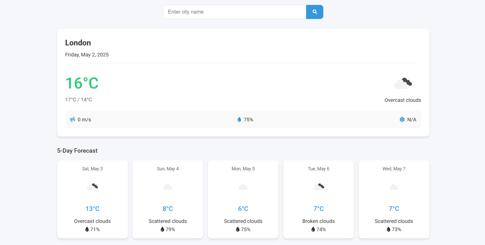

# Weather 4Caster

A sleek, responsive web application that provides current weather information and 5-day forecasts for any city around the world.



## Features

- 🔍 **City Search**: Find weather information for any city globally
- 🌡️ **Current Weather**: Display current temperature, conditions, wind speed, and humidity
- 📅 **5-Day Forecast**: View upcoming weather predictions
- 🎨 **Temperature Visualization**: Colors indicate temperature ranges (cold, cool, mild, warm, hot)
- 📱 **Responsive Design**: Works smoothly on desktop and mobile devices
- 🐳 **Docker Support**: Easy deployment with Docker


## Technologies Used

- **HTML5** and **CSS3** for structure and styling
- **JavaScript** for dynamic content and API interaction
- **OpenWeather API** for weather data
- **Font Awesome** for icons
- **Docker** for containerization

## Getting Started

### Prerequisites

- Node.js and npm installed on your machine
- API key from [OpenWeather](https://openweathermap.org/api) (Free tier available)
- Docker (optional, for containerized deployment)

### Installation

1. Clone the repository:
   ```bash
   git clone https://github.com/MokhtarLahjaily/weather-4caster.git
   cd weather-4caster
   ```

2. Install dependencies:
   ```bash
   npm install
   ```

3. Open `script.js` and replace the API key with your OpenWeather API key:
   ```javascript
   const API_KEY = "your-api-key-here";
   ```

4. Start the development server:
   ```bash
   npm start
   ```

5. Open your browser and navigate to `http://localhost:8080`

### Docker Deployment

1. Build the Docker image:
   ```bash
   docker build -t weather-4caster .
   ```

2. Run the container:
   ```bash
   docker run -d -p 8080:8080 weather-4caster
   ```

3. Access the application at `http://localhost:8080`

#### Push to Docker Hub

```bash
# Login to Docker Hub
docker login -u <your-docker-hub-username>

# Tag the image
docker tag weather-4caster <your-docker-hub-username>/weather-4caster:latest

# Push to Docker Hub
docker push <your-docker-hub-username>/weather-4caster:latest
```

## API Usage

This application uses the OpenWeather API to fetch weather data:

- Current Weather API: `api.openweathermap.org/data/2.5/weather`
- 5-Day Forecast API: `api.openweathermap.org/data/2.5/forecast`

For more information, visit the [OpenWeather API documentation](https://openweathermap.org/api).

## Project Structure

```
weather-4caster/
├── index.html          # Main HTML structure
├── styles.css          # CSS styling
├── script.js           # JavaScript functionality
├── package.json        # Project dependencies
├── Dockerfile          # Docker configuration
└── README.md           # Project documentation
```

## Features in Detail

### Current Weather Display
- City name and current date
- Current temperature with high/low for the day
- Weather icon and description
- Wind speed, humidity, and UV index information

### 5-Day Forecast
- Daily weather predictions for the upcoming 5 days
- Temperature, conditions, and humidity information
- Interactive card design with hover effects

### Responsive Design
- Adapts to various screen sizes from desktop to mobile
- Reorganizes layout components for optimal viewing on smaller devices

## Future Enhancements

- User location detection for automatic local weather
- Weather alerts and notifications
- Historical weather data visualization
- Dark/light theme toggle
- Unit conversion (Celsius/Fahrenheit)
- Weather maps integration

## Contributing

Contributions are welcome! Please feel free to submit a Pull Request.

1. Fork the repository
2. Create your feature branch (`git checkout -b feature/AmazingFeature`)
3. Commit your changes (`git commit -m 'Add some AmazingFeature'`)
4. Push to the branch (`git push origin feature/AmazingFeature`)
5. Open a Pull Request


## Acknowledgements

- [OpenWeather](https://openweathermap.org/) for providing the weather data API
- [Font Awesome](https://fontawesome.com/) for the icons
- [Google Fonts](https://fonts.google.com/) for the Roboto font

## Contact

Mokhtar Lahjaily - [GitHub](https://github.com/MokhtarLahjaily)

Project Link: [https://github.com/MokhtarLahjaily/weather-4caster](https://github.com/MokhtarLahjaily/4cast)
